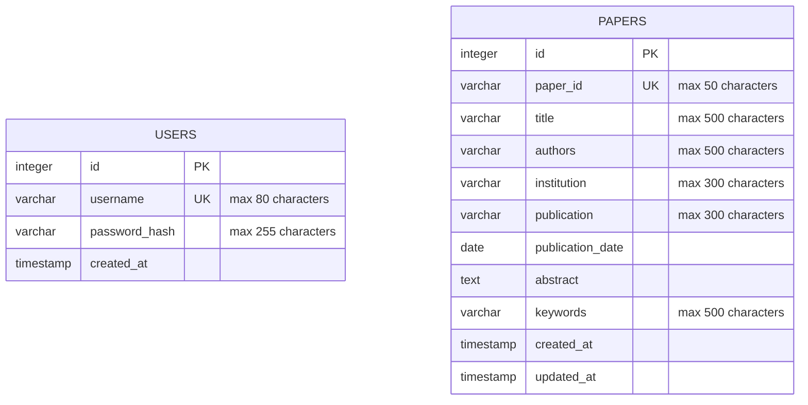
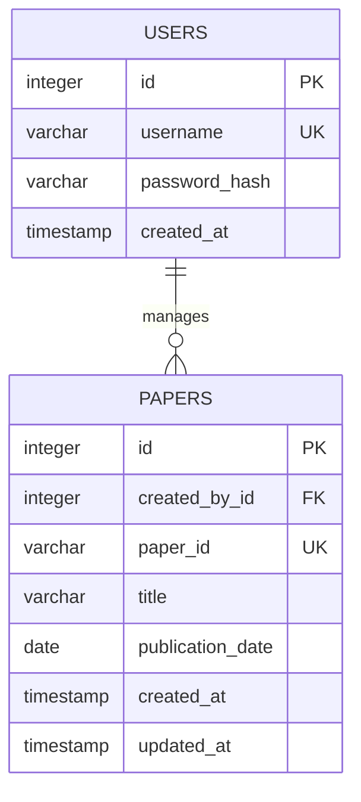

# Entity Relationship Diagram

The current database contains two independent entities:

- `users` stores login and authentication data.
- `papers` stores research paper metadata.

There is currently no foreign key relationship between the two tables. The
application uses the authenticated user for session access, but it does not
store an `owner_id`, `created_by`, or other user reference inside `papers`.

## ERD



## Relational Schema

### `users`

| Column | Type | Constraints | Description |
| --- | --- | --- | --- |
| `id` | `SERIAL` / `INTEGER` | Primary key | Internal user identifier |
| `username` | `VARCHAR(80)` | `NOT NULL`, `UNIQUE` | Login username |
| `password_hash` | `VARCHAR(255)` | `NOT NULL` | Argon2 password hash |
| `created_at` | `TIMESTAMP` | `NOT NULL`, default current timestamp | Account creation time |

### `papers`

| Column | Type | Constraints | Description |
| --- | --- | --- | --- |
| `id` | `SERIAL` / `INTEGER` | Primary key | Internal paper identifier |
| `paper_id` | `VARCHAR(50)` | `NOT NULL`, `UNIQUE` | Public/business paper identifier |
| `title` | `VARCHAR(500)` | `NOT NULL` | Research paper title |
| `authors` | `VARCHAR(500)` | `NOT NULL` | Author names |
| `institution` | `VARCHAR(300)` | `NOT NULL` | Author or research institution |
| `publication` | `VARCHAR(300)` | `NOT NULL` | Journal, conference, or publisher |
| `publication_date` | `DATE` | `NOT NULL` | Publication date |
| `abstract` | `TEXT` | `NOT NULL` | Paper abstract |
| `keywords` | `VARCHAR(500)` | `NOT NULL` | Semicolon-separated keywords |
| `created_at` | `TIMESTAMP` | `NOT NULL`, default current timestamp | Record creation time |
| `updated_at` | `TIMESTAMP` | `NOT NULL`, default current timestamp | Last record update time |

## Indexes

The `papers` table currently has indexes for:

- `paper_id`
- `title`
- `authors`
- `publication`
- `publication_date`

The `users.username` and `papers.paper_id` columns are indexed by their
`UNIQUE` constraints.

## Optional Future Relationship

If the system later needs multiple users or ownership tracking, add a user
reference to `papers`:



That future design would require a migration similar to:

```sql
ALTER TABLE papers
ADD COLUMN created_by_id INTEGER REFERENCES users(id);
```

